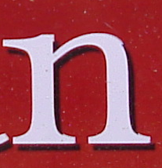
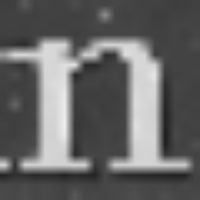

# ImageRecognition
A standard model of classification. I used a symbols data set to use two methods: KNN and Decision Tree. First of all I needed to grayscale and reshape each of the image to 20x20.

For the decision tree I used implemented library. The KNN algorithm was done from scratch.
